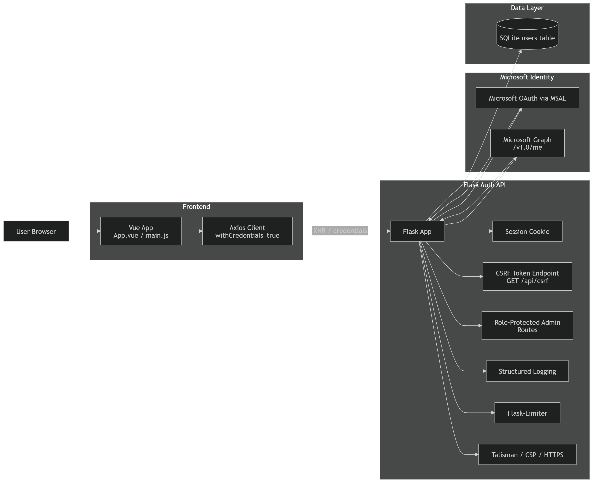
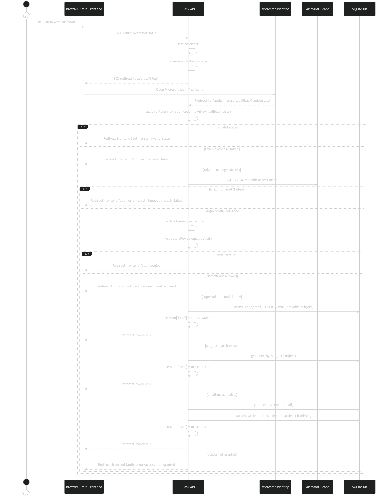
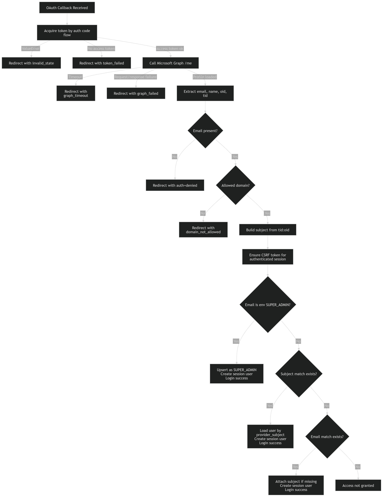
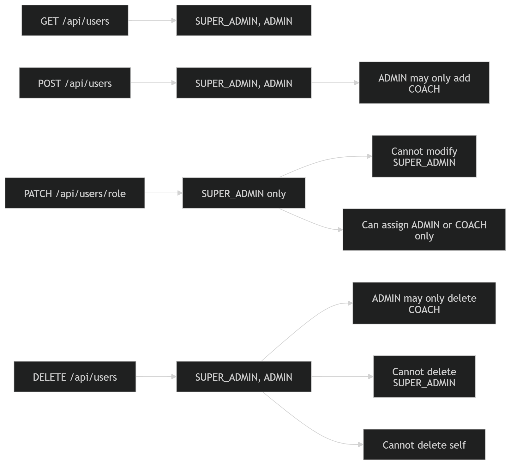
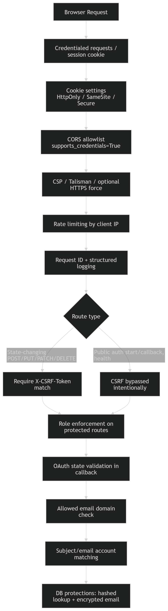
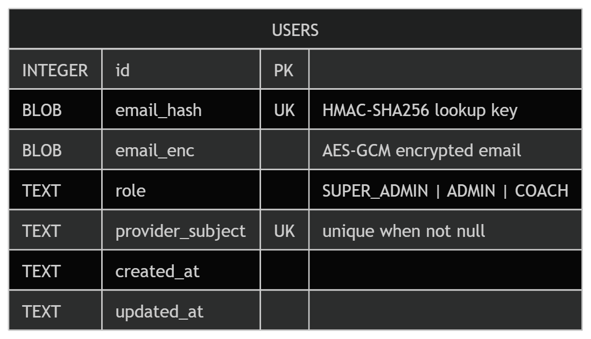

# Hashmark Authentication Service

Secure Microsoft OAuth authentication and role-based access control for the **Hashmark Recruiting Assistant** platform.

This service provides the **authentication and authorization layer** for the Hashmark system. It manages user login, session management, role-based access control, and administrative user management while maintaining strong security practices.

The system is designed to be:

- Secure
- Environment-driven
- Production-ready
- Easy to integrate with the Hashmark frontend

---

# Table of Contents

- Overview
- System Architecture
- Authentication Flow
- Authorization Model
- Security Design
- API Endpoints
- Development Setup
- Production Deployment
- Integration Notes
- Future Improvements

---

# Overview

The **Hashmark Authentication Service** provides a secure backend authentication layer using the **Microsoft Identity Platform (OAuth 2.0)**.

It allows authorized users to log in with their Microsoft accounts while enforcing **strict role-based permissions** and **admin-controlled access management**.

This service runs as a **standalone backend authentication service** that the Hashmark frontend communicates with via secure API requests.

---

# System Architecture

The system is composed of two main components:

- **Backend Authentication Service (Flask)**
- **Frontend Interface (Vue)**

The backend handles authentication, session management, security enforcement, and user administration.

The frontend communicates with the backend using:

- Cookie-based sessions
- CSRF tokens
- CORS-controlled requests



### Backend Structure

```
backend/
│
├── app.py
│   Flask application
│   OAuth flow
│   API routes
│   security enforcement
│
├── db.py
│   Database layer
│   encrypted identity storage
│   user persistence
│
├── .env.example
│   Environment configuration template
│
└── logs/
    Rotating log files (optional)
```

### Frontend Structure

```
frontend/
└── src/
    ├── api.js
    ├── App.vue
    ├── main.js
    ├── style.css
    └── assets/
        └── HashmarkLogoWHITE.svg
```

---

# Authentication Flow

Authentication uses **Microsoft OAuth via the Microsoft Identity Platform**.

The following diagram illustrates the full login process.



### Login Process

1. User clicks **Sign in with Microsoft**
2. Frontend redirects the user to `/auth/microsoft/login`
3. Backend initiates the Microsoft OAuth flow
4. Microsoft authenticates the user
5. Microsoft redirects the user to the backend callback
6. Backend exchanges the authorization code for an access token
7. Backend retrieves the user profile from Microsoft Graph
8. Backend validates user authorization and role
9. A secure session is created
10. User is redirected back to the frontend dashboard

---

# Authentication Decision Logic

During login the backend performs multiple validation steps to ensure the user is authorized to access the system.



Key validation steps include:

- Token validation
- Microsoft Graph identity verification
- Domain validation
- Database user lookup
- Role authorization checks

If any validation step fails, authentication is denied.

---

# Authorization Model

The system uses **three roles** to control system permissions.



## SUPER_ADMIN

Full administrative control.

Capabilities:

- Create users
- Delete users
- Change user roles
- View user list

Super admins are configured through environment variables:

```
SUPER_ADMIN_EMAILS
```

These accounts are automatically synchronized into the database when the server starts.

---

## ADMIN

Limited administrative access.

Capabilities:

- Create COACH users
- Delete COACH users
- View user list

Restrictions:

- Cannot create ADMIN users
- Cannot modify roles
- Cannot delete admins or super admins

---

## COACH

Standard application user.

Capabilities:

- Login
- Access recruiting tools

Restrictions:

- Cannot manage users

---

# Security Design

Security was a primary focus when designing the authentication system. Multiple defensive layers are implemented.



## OAuth Authentication

Authentication uses the **Microsoft Identity Platform**.

Authorization codes are exchanged securely using:

- **MSAL (Microsoft Authentication Library)**

---

## Encrypted User Storage

User emails are never stored in plaintext.

Instead the system uses:

- **AES-256-GCM encryption** for stored identity values
- **HMAC email hashing** for deterministic lookup

This allows secure identity storage while still supporting efficient database queries.

---

## Pseudonymous Logging

Sensitive identifiers are never written directly to logs.

Instead, the system generates pseudonymous identifiers using:

```
HMAC-SHA256
```

Example log entry:

```
event=login_success user_id=438f3163e4a37b3f role=ADMIN
```

Optional masked email logging can be enabled for debugging.

---

## CSRF Protection

All state-changing API requests require a CSRF token.

Token endpoint:

```
GET /api/csrf
```

Required request header:

```
X-CSRF-Token
```

---

## Rate Limiting

Sensitive endpoints are protected using **Flask-Limiter**.

Examples include:

- OAuth callback
- login attempts
- user creation
- role changes
- user deletion
- logout

Production deployments should configure a shared limiter backend such as **Redis**.

---

## Secure Sessions

Session cookies use secure settings:

```
HttpOnly
SameSite=Lax
Secure (production)
```

Session lifetime is configurable through environment variables.

---

# Database Schema

The database schema below illustrates how identities and roles are stored securely.



Key design characteristics:

- encrypted email storage
- deterministic identity lookup
- role-based access storage
- audit-friendly structure

---

# API Endpoints

## Health Check

```
GET /health
```

Response:

```
{ "ok": true }
```

---

## Authentication

### Start Login

```
GET /auth/microsoft/login
```

Redirects the user to Microsoft authentication.

---

### OAuth Callback

```
GET /auth/microsoft/callback
POST /auth/microsoft/callback
```

Handles OAuth redirect and creates the user session.

---

### Logout

```
POST /auth/logout
```

Destroys the active session.

---

## Session Information

### Current User

```
GET /api/me
```

Response:

```
{
  "email": "...",
  "role": "...",
  "name": "...",
  "subject": "..."
}
```

---

### CSRF Token

```
GET /api/csrf
```

Response:

```
{
  "csrfToken": "..."
}
```

---

## User Management

Requires `ADMIN` or `SUPER_ADMIN`.

### List Users

```
GET /api/users
```

---

### Add User

```
POST /api/users
```

Body:

```
{
  "email": "user@example.com",
  "role": "COACH"
}
```

---

### Change Role

```
PATCH /api/users/role
```

SUPER_ADMIN only.

---

### Delete User

```
DELETE /api/users
```

Body:

```
{
  "email": "user@example.com"
}
```

---

# Development Setup

This section explains how to run the authentication service locally.

The system includes:

- **Flask backend**
- **Vue frontend**

Both services must be running simultaneously.

---

# Prerequisites

Install:

- Python 3.10+
- Node.js 18+
- npm

You will also need a configured **Microsoft Azure App Registration**.

---

# Backend Setup

Navigate to the backend directory:

```
cd backend
```

Create a virtual environment:

```
python -m venv .venv
```

Activate it:

Windows:

```
.venv\Scripts\activate
```

Mac/Linux:

```
source .venv/bin/activate
```

Install dependencies:

```
pip install -r requirements.txt
```

---

# Environment Configuration

Create a `.env` file using `.env.example`.

Example development configuration:

```
APP_ENV=development

FLASK_SECRET_KEY=dev-secret

MICROSOFT_CLIENT_ID=your-client-id
MICROSOFT_CLIENT_SECRET=your-client-secret
MICROSOFT_TENANT=common

MICROSOFT_REDIRECT_URI=http://localhost:5000/auth/microsoft/callback

FRONTEND_URL=http://localhost:5173
CORS_ORIGINS=http://localhost:5173

SUPER_ADMIN_EMAILS=admin@example.com

EMAIL_HASH_PEPPER=replace-this
EMAIL_ENC_KEY_B64=replace-this
LOG_PSEUDO_KEY=replace-this

SESSION_HOURS=8
```

---

# Run Backend

```
python app.py
```

Backend runs on:

```
http://localhost:5000
```

---

# Frontend Setup

Navigate to the frontend directory:

```
cd frontend
```

Install dependencies:

```
npm install
```

Create `.env` if needed:

```
VITE_API_URL=http://localhost:5000
```

Run frontend:

```
npm run dev
```

Frontend runs on:

```
http://localhost:5173
```

---

# Running the Full System

| Service | URL |
|-------|------|
| Frontend | http://localhost:5173 |
| Backend | http://localhost:5000 |

Open the frontend and click **Sign in with Microsoft** to begin authentication.

---

# Production Deployment

Before deploying to production ensure:

- `APP_ENV=production`
- secure environment variables
- Microsoft redirect URI updated
- HTTPS enabled
- `COOKIE_SECURE=1`
- reverse proxy configured
- Gunicorn or WSGI server used
- Redis rate limiter configured
- logging enabled
- CORS restricted to trusted domains

---

# Integration Notes

Frontend must:

- send requests with `credentials: "include"`
- attach `X-CSRF-Token` to POST/PATCH/DELETE requests
- redirect users to `/auth/microsoft/login` to start login

---

# Future Improvements

Potential future enhancements:

- Redis rate limit storage
- centralized logging aggregation
- audit log export
- multi-tenant organization support
- optional invitation workflow
- PostgreSQL production database

---

# License

Internal use for the **Hashmark** project.
